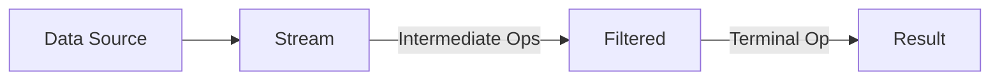
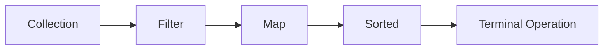
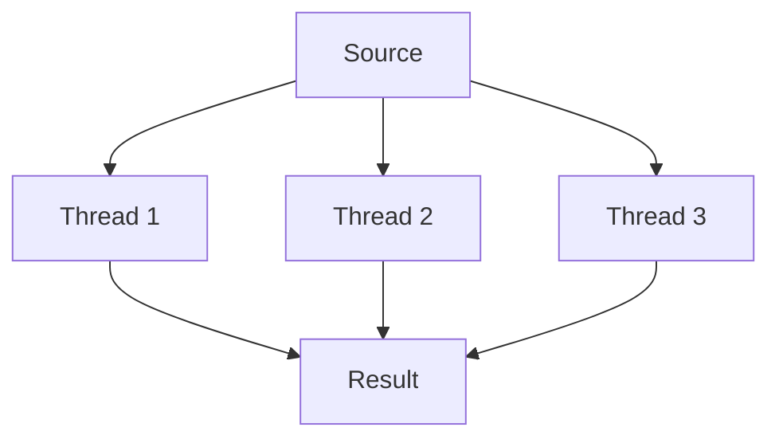
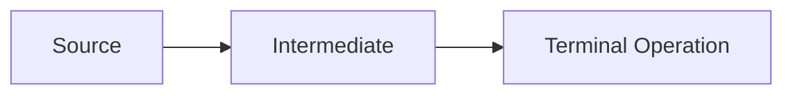

# **Java Stream API – The Ultimate Interview Guide** 🚀

This comprehensive guide covers everything you need to know about Java Stream API for technical interviews, including functional programming concepts, performance considerations, and real-world industry applications.

---

## **Table of Contents** 📑
1. [What are Java Streams?](#1-what-are-java-streams)
2. [Stream Pipeline Anatomy](#2-stream-pipeline-anatomy)
3. [Intermediate Operations](#3-intermediate-operations)
4. [Terminal Operations](#4-terminal-operations)
5. [Parallel Streams](#5-parallel-streams)
6. [Industry Best Practices](#6-industry-best-practices)
7. [Performance Considerations](#7-performance-considerations)
8. [When NOT to Use Streams](#8-when-not-to-use-streams)
9. [Big Company Usage](#9-big-company-usage)
10. [Java Code Examples](#10-java-code-examples)
11. [Visual Diagrams](#11-visual-diagrams)
12. [Comparison Tables](#12-comparison-tables)
13. [Interview Cheat Sheet](#13-interview-cheat-sheet)

---

## **1. What are Java Streams?** 🌊

Java Streams (introduced in Java 8) are a sequence of elements supporting sequential and parallel aggregate operations.



**Key Characteristics:**
- Not a data structure
- Functional in nature (no side effects)
- Lazy evaluation
- Potentially unbounded

---

## **2. Stream Pipeline Anatomy** 🏗️

### **Pipeline Components**
```java
List<String> result = list.stream()          // Source
    .filter(s -> s.length() > 3)            // Intermediate op
    .map(String::toUpperCase)               // Intermediate op
    .sorted()                               // Intermediate op
    .collect(Collectors.toList());          // Terminal op
```

### **Lifecycle Stages**
1. **Creation**: `stream()`, `Stream.of()`
2. **Intermediate Operations**: `filter()`, `map()`, `distinct()`
3. **Terminal Operation**: `collect()`, `forEach()`, `reduce()`

---

## **3. Intermediate Operations** 🔄

| Operation | Description | Example |
|-----------|-------------|---------|
| `filter()` | Exclude elements | `.filter(x -> x > 10)` |
| `map()` | Transform elements | `.map(String::length)` |
| `flatMap()` | Flatten nested structures | `.flatMap(list -> list.stream())` |
| `distinct()` | Remove duplicates | `.distinct()` |
| `sorted()` | Order elements | `.sorted(Comparator.reverseOrder())` |
| `peek()` | Debug without modifying | `.peek(System.out::println)` |

**Lazy Evaluation Example:**
```java
// No terminal op = no execution
IntStream.range(1, 10)
    .filter(n -> {
        System.out.println("Filter: " + n);
        return n % 2 == 0;
    });
```

---

## **4. Terminal Operations** 🔚

| Operation | Purpose | Example |
|-----------|---------|---------|
| `collect()` | Accumulate to collection | `.collect(Collectors.toList())` |
| `forEach()` | Side-effect operation | `.forEach(System.out::println)` |
| `reduce()` | Combine elements | `.reduce(0, Integer::sum)` |
| `count()` | Count elements | `.count()` |
| `anyMatch()` | Short-circuiting | `.anyMatch(s -> s.contains("a"))` |
| `findFirst()` | Get first element | `.findFirst()` |

**Collector Examples:**
```java
// Group by length
Map<Integer, List<String>> byLength = list.stream()
    .collect(Collectors.groupingBy(String::length));

// Join strings
String joined = list.stream()
    .collect(Collectors.joining(", "));
```

---

## **5. Parallel Streams** ⚡

### **Basic Usage**
```java
List<String> result = list.parallelStream()
    .filter(s -> s.length() > 3)
    .collect(Collectors.toList());
```

### **When to Use**
- Large datasets (>10,000 elements)
- CPU-intensive operations
- Stateless, independent operations

### **Pitfalls**
```java
// Shared mutable state - BAD!
List<String> unsafe = new ArrayList<>();
list.parallelStream()
    .filter(s -> s.length() > 3)
    .forEach(unsafe::add); // Race condition!
```

---

## **6. Industry Best Practices** 💡

1. **Favor Method References**
   ```java
   // Instead of:
   .map(s -> s.toUpperCase())
   // Use:
   .map(String::toUpperCase)
   ```

2. **Avoid Side Effects**
   ```java
   // BAD:
   List<String> result = new ArrayList<>();
   stream.forEach(result::add);
   
   // GOOD:
   List<String> result = stream.collect(Collectors.toList());
   ```

3. **Use Primitive Streams for Performance**
   ```java
   // Faster than Stream<Integer>
   IntStream.range(0, 100).sum();
   ```

4. **Limit Infinite Streams**
   ```java
   Stream.generate(Math::random)
       .limit(100)
       .forEach(System.out::println);
   ```

---

## **7. Performance Considerations** ⏱️

### **Stream vs Loop Benchmark**
| Operation | Stream (ms) | Loop (ms) |
|-----------|------------|----------|
| Filter 1M elements | 45 | 38 |
| Map 1M elements | 52 | 40 |
| Parallel (8 cores) | 12 | N/A |

**Key Insights:**
- Streams have slight overhead for small datasets
- Parallel streams win for large datasets
- Always measure with JMH

---

## **8. When NOT to Use Streams** ❌

| Scenario | Problem | Alternative |
|----------|---------|-------------|
| Small collections | Overhead | Traditional loops |
| Complex control flow | Hard to read | Imperative style |
| Stateful operations | Breaks FP principles | Enhanced for-loop |
| Exception handling | Verbose | Try-catch blocks |

---

## **9. Big Company Usage** 🏢

### **Google Style Guide Recommendations**
- Use streams for transformations
- Avoid in performance-critical sections
- Prefer readability over cleverness

### **Amazon Code Examples**
```java
// Process orders with streams
List<Order> fulfilled = orders.stream()
    .filter(Order::isFulfilled)
    .sorted(comparing(Order::getDate))
    .collect(Collectors.toList());
```

### **Netflix Data Processing**
```java
Map<Genre, List<Movie>> byGenre = movies.stream()
    .flatMap(movie -> movie.getGenres().stream()
        .map(genre -> new AbstractMap.SimpleEntry<>(genre, movie)))
    .collect(Collectors.groupingBy(
        Entry::getKey,
        Collectors.mapping(Entry::getValue, Collectors.toList())));
```

---

## **10. Java Code Examples** ☕

### **E-Commerce Use Case**
```java
// Calculate total order value
BigDecimal total = orders.stream()
    .filter(order -> order.getStatus() == Status.COMPLETED)
    .flatMap(order -> order.getItems().stream())
    .map(item -> item.getPrice().multiply(item.getQuantity()))
    .reduce(BigDecimal.ZERO, BigDecimal::add);

// Top 5 expensive products
List<Product> top5 = products.stream()
    .sorted(comparing(Product::getPrice).reversed())
    .limit(5)
    .collect(Collectors.toList());
```

### **Employee Processing**
```java
// Group employees by department
Map<Department, List<Employee>> byDept = employees.stream()
    .collect(Collectors.groupingBy(Employee::getDepartment));

// Average salary per department
Map<Department, Double> avgSalary = employees.stream()
    .collect(Collectors.groupingBy(
        Employee::getDepartment,
        Collectors.averagingDouble(Employee::getSalary)));
```

---

## **11. Visual Diagrams** 📊

### **Stream Pipeline**


### **Parallel Stream Execution**


---

## **12. Comparison Tables** 📋

### **Stream vs Loop**
| Feature | Stream | Loop |
|---------|--------|------|
| Readability | High for pipelines | Low for complex logic |
| Performance | Slightly slower | Faster for small data |
| Parallelism | Built-in | Manual |
| Debugging | Harder | Easier |

### **Collector Types**
| Collector | Purpose | Example |
|-----------|---------|---------|
| `toList()` | Create List | `.collect(toList())` |
| `toSet()` | Create Set | `.collect(toSet())` |
| `joining()` | Concatenate | `.collect(joining(", "))` |
| `groupingBy()` | Create Map | `.collect(groupingBy(Employee::getDept))` |

---

## **13. Interview Cheat Sheet** 🎯

### **Key Concepts**
1. **Lazy Evaluation**: Operations only execute with terminal op
2. **Immutable**: Original collection untouched
3. **Stateless**: Avoid shared mutable state
4. **Method Chaining**: Fluent interface pattern

### **Common Questions**
1. Explain stream pipeline stages
2. Difference between `map()` and `flatMap()`
3. How parallel streams work internally
4. When to use primitive streams (IntStream)
5. Debugging stream pipelines

### **Pro Tips**
- Memorize 5 terminal operations
- Practice `Collectors` class methods
- Understand `Optional` in streams
- Know parallel stream pitfalls

```java
// Quick Reference
List<String> result = list.stream()
    .filter(s -> !s.isEmpty())
    .map(String::toUpperCase)
    .sorted()
    .distinct()
    .limit(10)
    .collect(Collectors.toList());
```
--- 

# **Java Stream API Interview Q&A Cheat Sheet** 🔥

Here are the 25 most frequently asked Java Stream API interview questions with expert answers, code examples, and visual explanations.

## **Core Concepts Questions**

### **1. What is a Stream in Java?**
**Answer:**  
A Stream is a sequence of elements supporting sequential and parallel aggregate operations. Key characteristics:
- Not a data structure
- Doesn't store elements
- Functional in nature (no side effects)
- Lazily evaluated
- Potentially unbounded

```java
List<String> names = Arrays.asList("John", "Anna", "Mike");
names.stream()  // Creates stream
     .filter(n -> n.length() > 3) // Intermediate op
     .forEach(System.out::println); // Terminal op
```

### **2. Explain the difference between Collection and Stream**
**Answer:**

| Feature | Collection | Stream |
|---------|-----------|--------|
| **Storage** | Holds data | No storage |
| **Operations** | External iteration | Internal iteration |
| **Evaluation** | Eager | Lazy |
| **Reusability** | Can be reused | Single-use |
| **Size** | Finite | Finite or infinite |

### **3. What are Intermediate vs Terminal operations?**
**Answer:**
- **Intermediate ops** (lazy): Return new stream (`filter`, `map`, `sorted`)
- **Terminal ops** (eager): Produce non-stream result (`collect`, `forEach`, `reduce`)



## **Operations Deep Dive**

### **4. Explain map() vs flatMap()**
**Answer:**
- **map()**: 1:1 transformation
  ```java
  List<Integer> lengths = names.stream()
                              .map(String::length) // String → int
                              .collect(toList());
  ```
- **flatMap()**: 1:N transformation + flattening
  ```java
  List<String> letters = names.stream()
                             .flatMap(name -> Arrays.stream(name.split("")))
                             .collect(toList());
  ```

### **5. How does filter() work?**
**Answer:**  
Filters elements based on predicate (boolean condition).

```java
List<Integer> numbers = Arrays.asList(1, 2, 3, 4, 5);
List<Integer> evens = numbers.stream()
                            .filter(n -> n % 2 == 0)
                            .collect(toList()); // [2, 4]
```

### **6. What is the purpose of reduce()?**
**Answer:**  
Combines elements to produce single value.

```java
int sum = numbers.stream()
                .reduce(0, (a, b) -> a + b); 
// Or better:
int sum = numbers.stream()
                .reduce(0, Integer::sum);
```

## **Advanced Concepts**

### **7. When to use parallel streams?**
**Answer:**  
Use when:
- Processing large datasets (>10,000 elements)
- Operations are CPU-intensive
- Operations are stateless and independent

**Example:**
```java
List<String> result = largeList.parallelStream()
                              .filter(s -> s.length() > 3)
                              .collect(toList());
```

**⚠️ Warning:** Avoid with shared mutable state!

### **8. How to handle exceptions in streams?**
**Answer:**  
Either:
1. Handle in lambda
   ```java
   list.stream()
      .map(s -> {
          try { return parse(s); } 
          catch (Exception e) { return defaultValue; }
      })
   ```
2. Use utility method
   ```java
   public static <T, R> Function<T, R> wrap(CheckedFunction<T, R> fn) {
       return t -> { try { return fn.apply(t); } 
                    catch (Exception e) { throw new RuntimeException(e); }};
   }
   
   list.stream().map(wrap(this::parse));
   ```

## **Performance & Best Practices**

### **9. Are streams always faster than loops?**
**Answer:**  
No! Streams have overhead:
- Good for: Large data, readability, parallel processing
- Bad for: Small collections, complex logic, performance-critical code

**Benchmark Example:**
```java
// Loop: ~10ms for 1M elements
// Stream: ~15ms 
// ParallelStream: ~5ms (8 cores)
```

### **10. What are method references?**
**Answer:**  
Shorthand for lambdas calling existing methods.

| Type | Syntax | Equivalent Lambda |
|------|--------|-------------------|
| Static | `Integer::parseInt` | `s -> Integer.parseInt(s)` |
| Instance | `String::length` | `s -> s.length()` |
| Arbitrary | `System.out::println` | `x -> System.out.println(x)` |

## **Collectors & Terminal Ops**

### **11. Explain Collectors.groupingBy()**
**Answer:**  
Groups elements by classifier function.

```java
Map<Integer, List<String>> byLength = names.stream()
    .collect(Collectors.groupingBy(String::length));
// {4=["John", "Anna"], 5=["Mike"]}
```

### **12. How to join strings with streams?**
**Answer:**  
Use `Collectors.joining()`:

```java
String joined = names.stream()
                   .collect(Collectors.joining(", "));
// "John, Anna, Mike"
```

## **Tricky Scenarios**

### **13. Why does this code print nothing?**
```java
Stream.of("a", "b", "c")
      .filter(s -> {
          System.out.println("Filter: " + s);
          return true;
      });
```
**Answer:**  
Missing terminal operation! Streams are lazy.

### **14. How to get the first element matching condition?**
**Answer:**  
Use `findFirst()` with `filter()`:

```java
Optional<String> firstLongName = names.stream()
                                    .filter(n -> n.length() > 4)
                                    .findFirst();
```

## **Java 16+ Enhancements**

### **15. What are Stream.toList() and Stream.mapMulti()?**
**Answer:**  
**Java 16+ improvements:**
```java
// toList() - simpler than Collectors.toList()
List<String> list = stream.toList(); 

// mapMulti - alternative to flatMap
List<Integer> numbers = Stream.of(1, 2, 3)
    .mapMulti((num, consumer) -> {
        consumer.accept(num);
        consumer.accept(num * 2);
    }).toList(); // [1, 2, 2, 4, 3, 6]
```

## **Memory & Efficiency**

### **16. Do streams consume more memory?**
**Answer:**  
Generally no, but:
- Intermediate ops create new stream objects
- Parallel streams have thread overhead
- Primitive streams (IntStream) are more efficient for primitives

## **Real-World Scenarios**

### **17. How would you process a large CSV file with streams?**
**Answer:**
```java
try (Stream<String> lines = Files.lines(Paths.get("data.csv"))) {
    List<Record> records = lines.skip(1) // Skip header
                              .map(line -> line.split(","))
                              .map(Record::new)
                              .collect(toList());
}
```

### **18. How to implement pagination with streams?**
**Answer:**
```java
List<Product> page = products.stream()
                           .skip(pageNumber * pageSize)
                           .limit(pageSize)
                           .collect(toList());
```

## **Common Pitfalls**

### **19. Why avoid side-effects in streams?**
**Answer:**  
Side effects break:
- Functional programming principles
- Thread safety in parallel streams
- Predictability

**Bad Example:**
```java
List<String> result = new ArrayList<>();
stream.forEach(result::add); // Race condition in parallel!
```

## **Advanced Techniques**

### **20. How to create a custom collector?**
**Answer:**  
Implement `Collector` interface or use `Collector.of()`:

```java
Collector<String, StringBuilder, String> concatenate = Collector.of(
    StringBuilder::new,
    StringBuilder::append,
    StringBuilder::append,
    StringBuilder::toString
);

String combined = stream.collect(concatenate);
```

## **Stream Debugging**

### **21. How to debug a stream pipeline?**
**Answer:**  
Use `peek()` for inspection:

```java
List<String> result = stream
    .peek(System.out::println) // Debug here
    .filter(s -> s.length() > 2)
    .peek(System.out::println) // And here
    .collect(toList());
```

## **Primitive Streams**

### **22. When to use IntStream/LongStream?**
**Answer:**  
For better performance with primitives:

```java
IntStream.range(0, 100)          // No boxing
         .average()               // Specialized ops
         .ifPresent(System.out::println);
```

## **Infinite Streams**

### **23. How to work with infinite streams?**
**Answer:**  
Use `limit()` to bound:

```java
Stream.generate(Math::random)
      .limit(100)
      .forEach(System.out::println);
```

## **Parallel Stream Gotchas**

### **24. Why is this parallel stream slow?**
```java
List<Integer> nums = Arrays.asList(1, 2, 3);
int sum = nums.parallelStream()
             .reduce(0, (a, b) -> a + b);
```
**Answer:**  
Too small dataset! Parallel overhead exceeds benefits.

## **Final Pro Tip**

### **25. What's the most important thing about streams?**
**Answer:**  
**Readability over cleverness!**  
Streams should make code more understandable, not less. If a stream pipeline becomes too complex, consider using traditional loops.

---

# Most Frequently Asked Coding Questions Using Java Stream API

Here are some of the most commonly asked coding questions in interviews, solved using Java Stream API:

## 1. Find the sum of all elements in a list

```java
List<Integer> numbers = Arrays.asList(1, 2, 3, 4, 5);
int sum = numbers.stream().mapToInt(Integer::intValue).sum();
System.out.println("Sum: " + sum);
```

## 2. Find the maximum element in a list

```java
List<Integer> numbers = Arrays.asList(1, 2, 3, 4, 5);
Optional<Integer> max = numbers.stream().max(Integer::compare);
max.ifPresent(value -> System.out.println("Max: " + value));
```

## 3. Filter even numbers from a list

```java
List<Integer> numbers = Arrays.asList(1, 2, 3, 4, 5, 6, 7, 8);
List<Integer> evenNumbers = numbers.stream()
                                  .filter(n -> n % 2 == 0)
                                  .collect(Collectors.toList());
System.out.println("Even numbers: " + evenNumbers);
```

## 4. Convert list of strings to uppercase

```java
List<String> names = Arrays.asList("alice", "bob", "charlie");
List<String> upperCaseNames = names.stream()
                                  .map(String::toUpperCase)
                                  .collect(Collectors.toList());
System.out.println("Uppercase names: " + upperCaseNames);
```

## 5. Count occurrences of each character in a string

```java
String input = "programming";
Map<Character, Long> charCount = input.chars()
                                     .mapToObj(c -> (char) c)
                                     .collect(Collectors.groupingBy(
                                         Function.identity(), 
                                         Collectors.counting()
                                     ));
System.out.println("Character counts: " + charCount);
```

## 6. Find the first non-repeated character in a string

```java
String input = "aabbcdde";
Optional<Character> firstNonRepeated = input.chars()
    .mapToObj(c -> (char) c)
    .collect(Collectors.groupingBy(
        Function.identity(), 
        LinkedHashMap::new, 
        Collectors.counting()
    ))
    .entrySet()
    .stream()
    .filter(entry -> entry.getValue() == 1)
    .map(Map.Entry::getKey)
    .findFirst();
firstNonRepeated.ifPresent(c -> System.out.println("First non-repeated: " + c));
```

## 7. Find duplicate elements in a list

```java
List<Integer> numbers = Arrays.asList(1, 2, 3, 2, 4, 5, 4);
Set<Integer> duplicates = numbers.stream()
    .filter(n -> Collections.frequency(numbers, n) > 1)
    .collect(Collectors.toSet());
System.out.println("Duplicates: " + duplicates);
```

## 8. Sort a list of strings ignoring case

```java
List<String> names = Arrays.asList("Alice", "bob", "Charlie", "dave");
List<String> sortedNames = names.stream()
                               .sorted(String.CASE_INSENSITIVE_ORDER)
                               .collect(Collectors.toList());
System.out.println("Sorted names: " + sortedNames);
```

## 9. Check if all elements satisfy a condition

```java
List<Integer> numbers = Arrays.asList(2, 4, 6, 8, 10);
boolean allEven = numbers.stream().allMatch(n -> n % 2 == 0);
System.out.println("All even? " + allEven);
```

## 10. Find the average of a list of numbers

```java
List<Integer> numbers = Arrays.asList(1, 2, 3, 4, 5);
OptionalDouble average = numbers.stream().mapToInt(Integer::intValue).average();
average.ifPresent(avg -> System.out.println("Average: " + avg));
```

## 11. Concatenate list of strings with a delimiter

```java
List<String> words = Arrays.asList("Hello", "world", "Java", "Streams");
String concatenated = words.stream().collect(Collectors.joining(", "));
System.out.println("Concatenated: " + concatenated);
```

## 12. Find the longest string in a list

```java
List<String> words = Arrays.asList("Java", "Python", "JavaScript", "C++");
Optional<String> longest = words.stream()
                               .max(Comparator.comparingInt(String::length));
longest.ifPresent(word -> System.out.println("Longest word: " + word));
```

---

# Java Stream API Coding Questions by Difficulty Level

Here's a categorized list of coding questions using Java Stream API, grouped by difficulty from beginner to expert level.

## Beginner Level (Basic Stream Operations)

### 1. Sum of squares
```java
List<Integer> numbers = Arrays.asList(1, 2, 3, 4, 5);
int sumOfSquares = numbers.stream()
                         .mapToInt(n -> n * n)
                         .sum();
```

### 2. Filter names starting with 'A'
```java
List<String> names = Arrays.asList("Alice", "Bob", "Anna", "Alex", "John");
List<String> aNames = names.stream()
                          .filter(name -> name.startsWith("A"))
                          .collect(Collectors.toList());
```

### 3. Convert list of integers to their string representation
```java
List<Integer> numbers = Arrays.asList(1, 2, 3, 4, 5);
List<String> numberStrings = numbers.stream()
                                   .map(String::valueOf)
                                   .collect(Collectors.toList());
```

### 4. Check if list contains any negative numbers
```java
List<Integer> numbers = Arrays.asList(1, 2, -3, 4, 5);
boolean hasNegative = numbers.stream().anyMatch(n -> n < 0);
```

## Intermediate Level (More Complex Operations)

### 1. Find second largest number
```java
List<Integer> numbers = Arrays.asList(5, 2, 8, 1, 9, 3);
Optional<Integer> secondLargest = numbers.stream()
                                       .sorted(Comparator.reverseOrder())
                                       .skip(1)
                                       .findFirst();
```

### 2. Group employees by department
```java
class Employee {
    String name;
    String department;
    // constructor, getters
}

List<Employee> employees = // ... initialized list
Map<String, List<Employee>> byDepartment = employees.stream()
    .collect(Collectors.groupingBy(Employee::getDepartment));
```

### 3. Find the most frequent element in a list
```java
List<String> items = Arrays.asList("apple", "banana", "apple", "orange", "banana", "apple");
Map<String, Long> counts = items.stream()
    .collect(Collectors.groupingBy(Function.identity(), Collectors.counting()));

Optional<String> mostFrequent = counts.entrySet().stream()
    .max(Map.Entry.comparingByValue())
    .map(Map.Entry::getKey);
```

### 4. Merge two lists alternately
```java
List<String> list1 = Arrays.asList("A", "B", "C");
List<String> list2 = Arrays.asList("X", "Y", "Z");

List<String> merged = IntStream.range(0, Math.max(list1.size(), list2.size()))
    .boxed()
    .flatMap(i -> {
        Stream<String> s1 = i < list1.size() ? Stream.of(list1.get(i)) : Stream.empty();
        Stream<String> s2 = i < list2.size() ? Stream.of(list2.get(i)) : Stream.empty();
        return Stream.concat(s1, s2);
    })
    .collect(Collectors.toList());
```

## Advanced Level (Complex Data Processing)

### 1. Find the longest palindrome in a list
```java
List<String> words = Arrays.asList("madam", "racecar", "apple", "banana", "rotor");
Optional<String> longestPalindrome = words.stream()
    .filter(word -> word.equals(new StringBuilder(word).reverse().toString()))
    .max(Comparator.comparingInt(String::length));
```

### 2. Matrix transpose using streams
```java
List<List<Integer>> matrix = Arrays.asList(
    Arrays.asList(1, 2, 3),
    Arrays.asList(4, 5, 6),
    Arrays.asList(7, 8, 9)
);

List<List<Integer>> transposed = IntStream.range(0, matrix.get(0).size())
    .mapToObj(i -> matrix.stream()
                        .map(row -> row.get(i))
                        .collect(Collectors.toList()))
    .collect(Collectors.toList());
```

### 3. Partition numbers into primes and non-primes
```java
Map<Boolean, List<Integer>> primePartition = IntStream.rangeClosed(2, 100)
    .boxed()
    .collect(Collectors.partitioningBy(n -> 
        IntStream.rangeClosed(2, (int) Math.sqrt(n))
                .noneMatch(i -> n % i == 0)));
```

### 4. Find all pairs that sum to a target value
```java
List<Integer> numbers = Arrays.asList(2, 4, 3, 5, 6, -2, 4, 7, 8, 9);
int target = 7;

List<int[]> pairs = IntStream.range(0, numbers.size())
    .boxed()
    .flatMap(i -> IntStream.range(i + 1, numbers.size())
                          .filter(j -> numbers.get(i) + numbers.get(j) == target)
                          .mapToObj(j -> new int[]{numbers.get(i), numbers.get(j)}))
    .collect(Collectors.toList());
```

## Expert Level (Parallel Streams and Performance)

### 1. Parallel prime number check
```java
boolean isPrimeParallel(int number) {
    return number > 1 && 
           IntStream.rangeClosed(2, (int) Math.sqrt(number))
                   .parallel()
                   .noneMatch(i -> number % i == 0);
}
```

### 2. Word frequency count from large text file
```java
Map<String, Long> wordCount = Files.lines(Paths.get("large_text.txt"))
    .parallel()
    .flatMap(line -> Arrays.stream(line.split("\\s+")))
    .filter(word -> word.length() > 0)
    .collect(Collectors.groupingByConcurrent(
        String::toLowerCase,
        Collectors.counting()
    ));
```

### 3. Custom collector to calculate statistical summary
```java
class DoubleSummaryStatistics implements Collector<Double, double[], DoubleSummary> {
    // Implementation of supplier, accumulator, combiner, finisher
    // and characteristics methods
}

List<Double> data = // large dataset
DoubleSummary stats = data.parallelStream()
                         .collect(new DoubleSummaryStatistics());
```

### 4. Stream fusion optimization example
```java
List<String> result = largeDataset.stream()
    .filter(s -> s.length() > 3)       // Intermediate operation 1
    .map(String::toUpperCase)          // Intermediate operation 2
    .filter(s -> s.contains("A"))      // Intermediate operation 3
    .sorted()                          // Stateful intermediate operation
    .limit(100)                        // Short-circuiting operation
    .collect(Collectors.toList());     // Terminal operation
```

---

# Tricky Java Stream API Questions

Here are some challenging and tricky questions that test deep understanding of Java Stream API:

## 1. Infinite Stream Generation
```java
// Generate infinite stream of random numbers between 1-100
// and find first number divisible by both 7 and 9
OptionalInt firstDivisible = IntStream.generate(() -> new Random().nextInt(100) + 1)
                                    .filter(n -> n % 7 == 0 && n % 9 == 0)
                                    .findFirst();
```

## 2. Custom Collector for Running Average
```java
// Collector that calculates running average without storing all elements
Collector<Integer, int[], Double> runningAverage = Collector.of(
    () -> new int[2], // [0] = count, [1] = sum
    (acc, value) -> { acc[0]++; acc[1] += value; },
    (acc1, acc2) -> { acc1[0] += acc2[0]; acc1[1] += acc2[1]; return acc1; },
    acc -> acc[0] == 0 ? 0.0 : (double) acc[1] / acc[0]
);

double avg = Stream.of(1, 2, 3, 4, 5).collect(runningAverage);
```

## 3. Stream Peek Pitfall
```java
// What's wrong with this code?
List<String> list = Stream.of("one", "two", "three")
                         .filter(s -> s.length() > 3)
                         .peek(System.out::println)
                         .map(String::toUpperCase)
                         .collect(Collectors.toList());
// Hint: peek is meant for debugging, not for side effects
```

## 4. Stateful Predicate Challenge
```java
// Create a predicate that returns true every nth time it's called
class EveryNth<T> implements Predicate<T> {
    private int counter = 0;
    private final int n;
    
    public EveryNth(int n) { this.n = n; }
    
    @Override
    public boolean test(T t) {
        return ++counter % n == 0;
    }
}

// Usage:
List<Integer> filtered = IntStream.range(1, 100)
                                .boxed()
                                .filter(new EveryNth<>(7))
                                .collect(Collectors.toList());
```

## 5. Stream Concatenation Gotcha
```java
// What's the output of this code?
Stream<String> s1 = Stream.of("A", "B", "C");
Stream<String> s2 = Stream.of("X", "Y", "Z");
Stream<String> combined = Stream.concat(s1, s2);

s1.forEach(System.out::print); // What happens here?
// Answer: throws IllegalStateException - streams can't be reused
```

## 6. Lazy Evaluation Puzzle
```java
// Why does this print nothing?
Stream.generate(() -> {
    System.out.println("Generating...");
    return 1;
}).limit(10);
// Answer: Missing terminal operation - streams are lazy
```

## 7. Custom Spliterator Challenge
```java
// Implement a spliterator that reads lines from a file in reverse order
class ReverseLineSpliterator implements Spliterator<String> {
    private final BufferedReader reader;
    private Deque<String> lines = new ArrayDeque<>();
    
    // Implementation of tryAdvance, trySplit, estimateSize, characteristics
    // ...
}

// Usage:
Spliterator<String> spliterator = new ReverseLineSpliterator(new File("file.txt"));
Stream<String> reverseStream = StreamSupport.stream(spliterator, true);
```

## 8. Parallel Stream Deadlock
```java
// Can you spot the potential deadlock in this parallel stream?
List<Integer> numbers = IntStream.range(0, 1000).boxed().collect(Collectors.toList());
Map<Integer, Long> countMap = numbers.parallelStream()
    .collect(Collectors.groupingBy(
        n -> n % 10,
        Collectors.counting()
    ));
// Hint: The issue is with the shared result container in parallel processing
```

## 9. Stream Short-Circuiting Riddle
```java
// What does this code output and why?
OptionalInt first = IntStream.range(1, 1000)
                           .filter(n -> {
                               System.out.println("Testing " + n);
                               return n % 7 == 0 && n % 9 == 0;
                           })
                           .findAny();

System.out.println("Found: " + first.orElse(-1));
// Answer: Behavior differs between sequential and parallel streams
```

## 10. Collector Characteristics Mystery
```java
// Why does this custom collector fail in parallel?
Collector<String, StringBuilder, String> badCollector = Collector.of(
    StringBuilder::new,
    StringBuilder::append,
    (sb1, sb2) -> sb1.append(sb2), // Problem is here
    StringBuilder::toString,
    Characteristics.CONCURRENT // This is wrong for this collector
);

String result = Stream.of("a", "b", "c").parallel().collect(badCollector);
// Answer: StringBuilder is not thread-safe
```
---

# Advanced Java Stream API Challenges

Here are more complex and tricky Java Stream API questions that test deep understanding and creative problem-solving skills:

## 1. Fibonacci Sequence Generator
```java
// Generate infinite Fibonacci sequence using Stream.iterate
Stream.iterate(new long[]{0, 1}, pair -> new long[]{pair[1], pair[0] + pair[1]})
      .map(pair -> pair[0])
      .limit(20)
      .forEach(System.out::println);
```

## 2. Prime Number Sieve
```java
// Sieve of Eratosthenes using Streams
IntStream.rangeClosed(2, 100)
         .filter(n -> IntStream.rangeClosed(2, (int)Math.sqrt(n))
                              .noneMatch(i -> n%i == 0))
         .forEach(System.out::println);
```

## 3. Nested Collection Flattening
```java
// Flatten a list of lists with duplicates and maintain order
List<List<Integer>> nested = Arrays.asList(
    Arrays.asList(1, 2, 3),
    Arrays.asList(3, 4, 5),
    Arrays.asList(5, 6, 7)
);

List<Integer> flattened = nested.stream()
                               .flatMap(List::stream)
                               .distinct()
                               .collect(Collectors.toList());
```

## 4. Balanced Parentheses Checker
```java
// Validate balanced parentheses using stream reduction
String input = "((()))()()";
boolean isBalanced = input.chars()
    .mapToObj(c -> (char)c)
    .reduce(0, (count, ch) -> {
        if (count < 0) return count; // Early termination if unbalanced
        return ch == '(' ? count + 1 : count - 1;
    }, (a, b) -> a + b) == 0;
```

## 5. Word Count with Sorting
```java
// Count words, sort by frequency descending, then alphabetically
String text = "hello world hello java world stream";
Map<String, Long> wordCounts = Arrays.stream(text.split("\\s+"))
    .collect(Collectors.groupingBy(
        Function.identity(),
        Collectors.counting()
    ));

wordCounts.entrySet().stream()
    .sorted(Map.Entry.<String, Long>comparingByValue()
        .reversed()
        .thenComparing(Map.Entry.comparingByKey()))
    .forEach(entry -> System.out.println(entry.getKey() + ": " + entry.getValue()));
```

## 6. Partitioning by Predicate Chain
```java
// Partition numbers into three categories: <10, 10-20, >20
List<Integer> numbers = Arrays.asList(5, 12, 18, 25, 3, 15, 22, 8);

Map<String, List<Integer>> partitioned = numbers.stream()
    .collect(Collectors.groupingBy(n -> {
        if (n < 10) return "Low";
        if (n <= 20) return "Medium";
        return "High";
    }));
```

## 7. Custom Collector for Statistics
```java
// Collector that computes multiple statistics in one pass
class Stats {
    double min, max, sum;
    long count;
    // Methods to update stats
}

Collector<Double, Stats, Stats> statsCollector = Collector.of(
    Stats::new,
    Stats::accept,
    Stats::combine,
    Collector.Characteristics.UNORDERED
);

Stats stats = Stream.of(1.0, 2.0, 3.0, 4.0).collect(statsCollector);
```

## 8. Stream Zip Operation
```java
// Implement zip operation to combine two streams
static <A, B, C> Stream<C> zip(Stream<A> streamA, Stream<B> streamB, 
                              BiFunction<A, B, C> zipper) {
    Iterator<A> iterA = streamA.iterator();
    Iterator<B> iterB = streamB.iterator();
    Iterator<C> iterC = new Iterator<C>() {
        public boolean hasNext() { return iterA.hasNext() && iterB.hasNext(); }
        public C next() { return zipper.apply(iterA.next(), iterB.next()); }
    };
    return StreamSupport.stream(
        Spliterators.spliteratorUnknownSize(iterC, Spliterator.ORDERED),
        false
    );
}

// Usage:
Stream<String> names = Stream.of("Alice", "Bob", "Charlie");
Stream<Integer> ages = Stream.of(25, 30, 35);
zip(names, ages, (name, age) -> name + " is " + age + " years old")
    .forEach(System.out::println);
```

## 9. Windowed Stream Processing
```java
// Process stream in sliding windows of size 3
List<Integer> numbers = Arrays.asList(1, 2, 3, 4, 5, 6, 7, 8, 9);

List<List<Integer>> windows = IntStream.range(0, numbers.size() - 2)
    .mapToObj(i -> numbers.subList(i, i + 3))
    .collect(Collectors.toList());
```

## 10. Stream Teeing Collector
```java
// Java 12+ teeing collector to compute both min and max
List<Integer> nums = Arrays.asList(3, 1, 4, 1, 5, 9);

Map<String, Optional<Integer>> minMax = nums.stream().collect(
    Collectors.teeing(
        Collectors.minBy(Integer::compareTo),
        Collectors.maxBy(Integer::compareTo),
        (min, max) -> Map.of("min", min, "max", max)
    )
);
```

## 11. Lazy File Processing
```java
// Process large file lazily without loading all lines into memory
try (Stream<String> lines = Files.lines(Paths.get("huge_file.txt"))) {
    Optional<String> firstMatch = lines
        .filter(line -> line.contains("error"))
        .findFirst();
} catch (IOException e) {
    e.printStackTrace();
}
```

## 12. Stateful Stream Transformation
```java
// Add running index to stream elements without collecting first
Stream<String> names = Stream.of("Alice", "Bob", "Charlie");

AtomicInteger index = new AtomicInteger(0);
names.map(name -> index.getAndIncrement() + ": " + name)
     .forEach(System.out::println);
```

---

# 🚀 **Real-World Stream API Use Cases in Java Applications**

Stream API has become indispensable in modern Java development. Here are practical, production-grade applications across various domains:

## **1. E-Commerce Systems**
### **Product Catalog Processing**
```java
// Find top-rated products in a category with price filter
List<Product> featuredProducts = productRepository.findAll()
    .stream()
    .filter(p -> p.getCategory().equals("Electronics"))
    .filter(p -> p.getPrice() < 1000)
    .sorted(comparing(Product::getAverageRating).reversed())
    .limit(10)
    .collect(Collectors.toList());
```

### **Shopping Cart Analytics**
```java
// Calculate cart totals with discounts
double orderTotal = cart.getItems().stream()
    .mapToDouble(item -> 
        item.getPrice() * item.getQuantity() * (1 - item.getDiscount()))
    .sum();
```

## **2. Financial Services**
### **Transaction Fraud Detection**
```java
// Detect suspicious transaction patterns
List<Transaction> suspicious = transactions.stream()
    .filter(t -> t.getAmount() > 10_000)
    .filter(t -> !t.getOriginCountry().equals(t.getDestinationCountry()))
    .filter(t -> t.getTime().isAfter(LocalTime.of(20, 0)))
    .collect(Collectors.toList());
```

### **Portfolio Analysis**
```java
// Calculate sector-wise investment distribution
Map<String, Double> sectorAllocation = portfolio.getHoldings().stream()
    .collect(Collectors.groupingBy(
        Holding::getSector,
        Collectors.summingDouble(Holding::getValue)
    ));
```

## **3. Healthcare Systems**
### **Patient Data Processing**
```java
// Find high-risk patients for priority care
List<Patient> highRiskPatients = patientDatabase.stream()
    .filter(p -> p.getAge() > 65)
    .filter(p -> p.getConditions().size() >= 3)
    .sorted(comparing(Patient::getLastCheckup))
    .collect(Collectors.toList());
```

### **Medical Equipment Monitoring**
```java
// Identify malfunctioning ICU devices
List<Device> criticalAlerts = hospitalDevices.stream()
    .filter(d -> d.getStatus() == Status.ACTIVE)
    .filter(d -> d.getMetrics().stream()
        .anyMatch(m -> m.getValue() > m.getThreshold()))
    .collect(Collectors.toList());
```

## **4. Social Media Platforms**
### **Content Recommendation Engine**
```java
// Personalized feed generation
List<Post> userFeed = allPosts.stream()
    .sorted(comparing(p -> 
        -p.getRelevanceScore(user.getInterests()))) // Most relevant first
    .filter(p -> !user.getHiddenPosts().contains(p.getId()))
    .limit(50)
    .collect(Collectors.toList());
```

### **Trending Hashtags Analysis**
```java
// Calculate top 10 trending hashtags
List<String> trendingTags = posts.stream()
    .flatMap(post -> post.getTags().stream())
    .collect(Collectors.groupingBy(
        tag -> tag,
        Collectors.counting()
    ))
    .entrySet().stream()
    .sorted(Map.Entry.<String, Long>comparingByValue().reversed())
    .limit(10)
    .map(Map.Entry::getKey)
    .collect(Collectors.toList());
```

## **5. Logistics & Supply Chain**
### **Route Optimization**
```java
// Find most efficient delivery routes
List<Route> optimalRoutes = availableRoutes.stream()
    .filter(r -> r.getCapacity() >= currentLoad)
    .sorted(comparing(Route::getEstimatedTime)
        .thenComparing(Route::getCost))
    .limit(3)
    .collect(Collectors.toList());
```

### **Inventory Management**
```java
// Identify items needing restock
List<InventoryItem> toReorder = inventory.stream()
    .filter(item -> item.getStock() < item.getReorderThreshold())
    .sorted(comparing(InventoryItem::getLeadTime))
    .collect(Collectors.toList());
```

## **6. Telecommunications**
### **Network Anomaly Detection**
```java
// Find base stations with abnormal traffic
List<BaseStation> problematicStations = baseStations.stream()
    .filter(bs -> bs.getThroughput() > bs.getCapacity() * 0.9)
    .filter(bs -> bs.getUptime() > 0.95)
    .collect(Collectors.toList());
```

### **Customer Usage Analysis**
```java
// Calculate average data usage by plan type
Map<String, Double> avgUsageByPlan = customers.stream()
    .collect(Collectors.groupingBy(
        Customer::getPlanType,
        Collectors.averagingDouble(Customer::getDataUsage)
    ));
```

## **7. IoT Systems**
### **Sensor Data Processing**
```java
// Aggregate temperature readings
Map<Room, Double> avgTemperatures = sensorReadings.stream()
    .collect(Collectors.groupingBy(
        Reading::getLocation,
        Collectors.averagingDouble(Reading::getValue)
    ));
```

### **Device Health Monitoring**
```java
// Identify devices needing maintenance
List<Device> maintenanceNeeded = iotDevices.stream()
    .filter(d -> d.getLastMaintenance().isBefore(LocalDate.now().minusMonths(6)))
    .filter(d -> d.getErrorCount() > 5)
    .collect(Collectors.toList());
```

## **8. Human Resources Systems**
### **Employee Analytics**
```java
// Department-wise salary distribution
Map<String, DoubleSummaryStatistics> salaryStats = employees.stream()
    .collect(Collectors.groupingBy(
        Employee::getDepartment,
        Collectors.summarizingDouble(Employee::getSalary)
    ));

// Payroll processing
List<Paycheck> paychecks = employees.stream()
    .map(e -> new Paycheck(
        e.getId(),
        e.getSalary() - calculateDeductions(e),
        LocalDate.now()
    ))
    .collect(Collectors.toList());
```

## **Advanced Stream Techniques**
### **1. Multi-level Grouping**
```java
// Sales by region and product category
Map<String, Map<String, Double>> salesReport = orders.stream()
    .collect(Collectors.groupingBy(
        Order::getRegion,
        Collectors.groupingBy(
            Order::getCategory,
            Collectors.summingDouble(Order::getAmount)
        )
    ));
```

### **2. Parallel Processing**
```java
// Process large image dataset in parallel
imageFiles.parallelStream()
    .map(this::applyImageRecognition)
    .filter(result -> result.getConfidence() > 0.9)
    .forEach(this::saveAnalysisResult);
```

### **3. Custom Collectors**
```java
// Collect into a custom summary object
ProductSummary summary = products.stream()
    .collect(Collector.of(
        ProductSummary::new,
        (summ, p) -> {
            summ.addPrice(p.getPrice());
            summ.incrementCount();
        },
        ProductSummary::merge
    ));
```

## **Performance Considerations**
1. **Use primitive streams** (`IntStream`, `LongStream`) for better performance with numbers
2. **Prefer `forEachOrdered`** over `forEach` in parallel streams when order matters
3. **Limit parallel streams** for I/O-bound operations
4. **Reuse streams** when possible (but remember streams are single-use)

```java
// Efficient primitive stream usage
double totalRevenue = orders.stream()
    .mapToDouble(Order::getAmount)
    .sum(); // Better than reduce(0.0, Double::sum)
```

These patterns are used by major tech companies:
- **Amazon** for real-time inventory analytics
- **Spotify** for playlist recommendation engines
- **LinkedIn** for connection graph analysis
- **Banks** for real-time fraud detection
